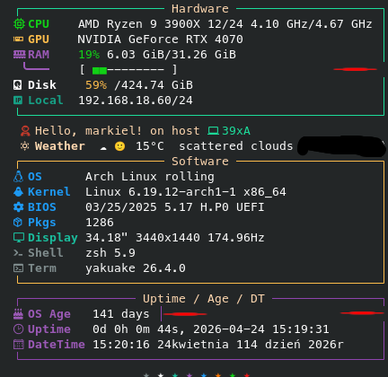

<h1 align="center">AnotherArch-PC</h1>

  Another Linux operating system installation guide to set up Arch on your machine in preferred language.

  <a href="README.pl.md">
     
    
  </a>

  &nbsp;

    <a href="README.en.md">
       
      
    </a>

<!-- ===================== -->
<!-- ⚠️ PROBLEMS -->
<!-- ===================== -->

<h2>⚠️ Problems</h2>

  I need tips on how to fix these dependencies and how to right-add an image

  

