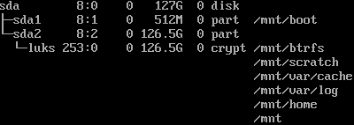

To jest instrukcja instalacji Arch Linux z UEFI, tworzeniem partycji, konfiguracją bootloadera, sieci i instalacją środowiska graficznego.
Wciąż ją rozwijam i dziekuję za wszelkie sugestię, bo zostało sporo poprawek.

[ ] Dodać grafiki/zrzuty ekranu

[ ] poprawić kolorystyke

<details>
<summary>Instalacja systemu </summary>

## 1. Sprawdź tryb UEFI 
Upewnij się, że system wystartował w trybie UEFI:

```sh
ls /sys/firmware/efi/efivars
```

Jeśli katalog istnieje, jesteś w trybie UEFI;


## 2. Sprawdź połączenie sieciowe i ustaw zegar systemowy
Przetestuj łączność z Internetem:

```sh
ping -c 3 archlinux.org
```

Włącz synchronizację czasu:

```sh
timedatectl set-ntp true && timedatectl set-local-rtc true
```

## 3. Partycjonowanie dysku
Stwórz partycje na docelowym dysku:

```sh
fdisk -l
cfdisk /dev/sdX
```

Przykładowy układ dla UEFI:
- `/dev/sdb1` — EFI 512M, FAT32
- `/dev/sdb2` — root, ext4/btrfs
- `/dev/sdb3` — home, btrfs

Dostosuj nazwy urządzeń do swojego systemu;

<details>
<summary>system bez szyfrowania </summary>

## 4. Utwórz systemy plików

```sh
mkfs.fat -F32 /dev/sdb1
mkfs.ext4 /dev/sdb2
mkfs.btrfs /dev/sdb3
```

Jeśli root ma być na btrfs:

```sh
mkfs.btrfs /dev/sdb2
```

## 5. Zamontuj partycje

```sh
mount /dev/sdb2 /mnt
mkdir -p /mnt/{boot,home}
mount /dev/sdb1 /mnt/boot
mount /dev/sdb3 /mnt/home
```

## 6. Zainstaluj system podstawowy

```sh
pacstrap /mnt base base-devel linux linux-firmware nano usbutils amd-ucode btrfs-progs networkmanager
```

- W przypadku procesora Intel użyj `intel-ucode` zamiast `amd-ucode`.

Następnie:

```sh
genfstab -U /mnt >> /mnt/etc/fstab
arch-chroot /mnt
```

## 7. Konfiguracja systemu
Ustaw strefę czasową i zegar:

```sh
ln -sf /usr/share/zoneinfo/Europe/Warsaw /etc/localtime
hwclock --systohc --utc
```

Włącz lokalizacje:

```sh
echo "en_US.UTF-8 UTF-8" >> /etc/locale.gen
echo "pl_PL.UTF-8 UTF-8" >> /etc/locale.gen
locale-gen
```

Ustaw zmienną językową:

```sh
echo "LANG=en_US.UTF-8" > /etc/locale.conf
```

Skonfiguruj konsolę `/etc/vconsole.conf`:

```
KEYMAP=pl
FONT=Lat2-Terminus16.psfu
```

Ustaw nazwę hosta:

```sh
echo "mojhost" > /etc/hostname
```
Zamień `mojhost` na własną nazwę hosta.
Skonfiguruj plik `/etc/hosts`:

```
127.0.0.1 localhost.localdomain localhost
::1       localhost.localdomain localhost
127.0.1.1 mojhost.localdomain mojhost
```


## 8. Utwórz initramfs i hasło administratora

```sh
mkinitcpio -P
passwd
```

Dodaj użytkownika:

```sh
useradd -m -g users -G wheel,storage,power -s /bin/bash -d /home/<uzytkownik> <uzytkownik>
passwd <uzytkownik>
```

Zastąp `<uzytkownik>` swoją nazwą użytkownika;

</details>

<details>
<summary>LUKS  - nie działą jeszcze -problem z konfiguracją</summary>

## 4. Utwórz system plików i zamontuj partycje

```
cryptsetup luksFormat /dev/sdX2
cryptsetup open /dev/sdX2 luks
mkfs.btrfs -L arch /dev/mapper/luks
mount /dev/mapper/luks /mnt
```

## 5. Utwórz podwoluminy BTRFS i swap

```
btrfs subvolume create /mnt/@
btrfs subvolume create /mnt/@swap
btrfs subvolume create /mnt/@home
btrfs subvolume create /mnt/@log
btrfs subvolume create /mnt/@cache
btrfs subvolume create /mnt/@scratch
```

Zamontuj ponownie partycję i utworz punkty montowania
```
umount /mnt
mount -o noatime,ssd,compress=zstd,subvol=@ /dev/mapper/luks /mnt

mkdir -p /mnt/{boot,home,var/log,var/cache,scratch,btrfs}

mount -o noatime,ssd,compress=zstd,subvol=@home /dev/mapper/luks /mnt/home
mount -o noatime,ssd,compress=zstd,subvol=@log /dev/mapper/luks /mnt/var/log
mount -o noatime,ssd,compress=zstd,subvol=@cache /dev/mapper/luks /mnt/var/cache
mount -o noatime,ssd,compress=zstd,subvol=@scratch /dev/mapper/luks /mnt/scratch
mount -o noatime,ssd,compress=zstd,subvolid=5 /dev/mapper/luks /mnt/btrfs  # const 5 for BTRFS's root

mkfs.fat -F32 /dev/sdX1
mount /dev/sdX /mnt/boot
```

<h1 align="center">
</h1>


swapfile:
```
cd /mnt/btrfs/@swap
btrfs filesystem mkswapfile --size 20g --uuid clear ./swapfile  # replace 20 with a number slightly larger than your ram if you want to hibernate
swapon ./swapfile
cd
```

## 6. Zainstaluj system podstawowy
[Reflector](https://wiki.archlinux.org/title/Reflector) to narzędzie w Arch Linux służące do automatycznego wyboru i aktualizacji listy najszybszych serwerów (mirrorów) repozytoriów pakietów.

```
cp /etc/pacman.d/mirrorlist /etc/pacman.d/mirrorlist.bak  # backup mirrorlist
reflector -c "PL" -f 12 -l 10 -n 12 --verbose --save /etc/pacman.d/mirrorlist  # (replace PL with your country code)
```
Odkomentuj wiersze dla pakietów 32-bitowych, a następnie zainstaluj system

```
nano /etc/pacman.conf
 ---
 [multilib]
 Include = /etc/pacman.d/mirrorlist
 ---

pacman -Syy

pacstrap -K /mnt base base-devel linux linux-firmware nano usbutils <"architectureCPU">-ucode btrfs-progs networkmanager sudo git reflector

genfstab -U /mnt >> /mnt/etc/fstab
```

## 7. Konfiguracja systemu
```
arch-chroot /mnt
```
Ustaw strefę czasową
```
ln -sf /usr/share/zoneinfo/Europe/Warsaw /etc/localtime  # zastąp własną strefą czasową
hwclock --systohc --utc
```
Ustaw obsługe polskich znaków
```
nano /etc/locale.gen
 ---
 (uncomment) #en_US.UTF-8 UTF-8
 (uncomment) #pl_PL.UTF-8 UTF-8
 ---
locale-gen

echo LANG=en_US.UTF-8 > /etc/locale.conf

nano/etc/vconsole.conf
 ---
 KEYMAP=pl
 FONT=Lat2-Terminus16.psfu.gz
 FONT_MAP=8859-2
```
Ustaw nazwę maszyny, adres i hasło administratora. Następnie lokalnego urzytkownika
```
echo "ArchLinux" > /etc/hostname  # zastąp własną nazwą hosta

nano /etc/hosts
 ---
 127.0.0.1 ArchLinux.localdomain localhost
 ::1       localhost.localdomain localhost
 ---

passwd

useradd -mG wheel,storage,power,log,adm,uucp,tss,rfkill -g users -s /bin/bash -d /home/<username> <username># replace with your username
passwd <username>
```

Udziel użytkownikowi dostępu sudo
```
nano /ect/sudoers
 ---
 (uncomment one) # %wheel ALL=(ALL:ALL) ALL
 ---
``` 
Uruchom internet
```
systemctl enable NetworkManager
```
Uzupełnij `mkinitcpio`
```
nano /etc/mkinitcpio.conf
 ---
 HOOKS=(base keyboard systemd autodetect modconf kms block keymap sd-vconsole sd-encrypt btrfs filesystems fsck)

mkinitcpio -P
```


## 8. Utwórz initramfs i hasło administratora


</details>

</details>

<details>
<summary>Instalacja programu rozruchowego </summary>

## 9. Instalacja sieci i bootloadera
Zainstaluj NetworkManager i włącz usługę:

```sh
pacman -S networkmanager
systemctl enable NetworkManager
```

Po restarcie możesz połączyć się z Wi-Fi:

```sh
nmcli device wifi connect <SSID> password <PASSWORD>
```

### Opcja 1: systemd-boot

```sh
pacman -S --needed efibootmgr dosfstools
bootctl --path=/boot install
```

Utwórz `/boot/loader/loader.conf`:

```ini
default arch
timeout 3
console-mode max
editor no
```

Utwórz `/boot/loader/entries/arch.conf`:

```ini
title   Arch Linux
linux   /vmlinuz-linux
initrd  /initramfs-linux.img
options root=/dev/sdb2 rw
```

### Opcja 2: GRUB

```sh
pacman -S --needed grub efibootmgr os-prober
grub-install --target=x86_64-efi --efi-directory=/boot --bootloader-id=GRUB
grub-mkconfig -o /boot/grub/grub.cfg
```

### Opcja 3: rEFInd

```sh
pacman -S --needed refind
refind-install
```

Opcjonalnie edytuj `/boot/EFI/refind/refind.conf`, jeśli potrzebujesz niestandardowych ścieżek do jądra lub initramfs.

## 10. Zakończenie instalacji

```sh
exit
umount -R /mnt
reboot
```
Odłącz Nosnijk instalacyjny;

</details>

<details>
<summary> Personalizacja </summary>

## 11. Włącz multilib
W pliku `/etc/pacman.conf` popraw sekcję:

```ini
# Misc options
#UseSyslog
Color
#NoProgressBar
CheckSpace
#VerbosePkgLists
ParallelDownloads = 5
DownloadUser = alpm
#DisableSandbox
ILoveCandy

[multilib]
Include = /etc/pacman.d/mirrorlist
```

Następnie zsynchronizuj bazy pakietów:

```sh
pacman -Syu
```

## 12. Mirrorlist i reflector

https://wiki.archlinux.org/title/Reflector
```sh
pacman -S reflector rsync curl
reflector --verbose --country "your country" --age 24 --sort rate --save /etc/pacman.d/mirrorlist
```

Lub alternatywnie:

```sh
reflector --verbose --latest 200 --age 24 --protocol http,https --sort rate --save /etc/pacman.d/mirrorlist
```

## 13. Instalacja AUR i firmware
Zainstaluj Git i zbuduj `yay`:

```sh
pacman -S git
cd /opt
git clone https://aur.archlinux.org/yay-git.git
chown -R $USER:$USER yay-git
cd yay-git
makepkg -si
```

Brakujące firmware:

https://wiki.archlinux.org/title/Mkinitcpio#Possibly_missing_firmware_for_module_XXXX

Jeśli potrzeba, przebuduj initramfs:

```sh
mkinitcpio -p linux
```
</details>

<details>
<summary> Instalacja nakładki graficznej </summary>


## 14. Instalacja pulpitu
{
- dodac instalację sterowników GPU;
- rozbić instalację na różne środowiśka i ich personalizację;
- utworzyć skrypty instalacyjne gotowych rozwiązań.
}

Zainstaluj Xorg i KDE:

```sh
yay -S xorg xorg-xinit brave-bin plasma-nm plasma-pa dolphin konsole kdeplasma-addons yakuake
```

Włącz SDDM:

```sh
systemctl enable sddm
```

## 15. Restart

```sh
reboot
```
</details>

## Uwagi
- Zastąp `/dev/sdX`, `/dev/sdb1`, `/dev/sdb2`, `/dev/sdb3` właściwymi urządzeniami.
- Użyj `amd-ucode` lub `intel-ucode` zgodnie z procesorem.
- Pakiet `base-devel` jest potrzebny do budowania pakietów z AUR.


